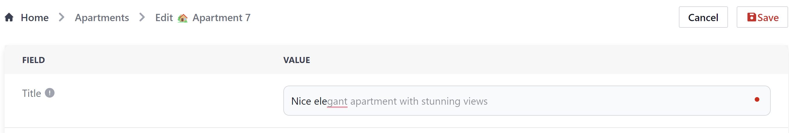

# Vue suggestion input

Text input with Tab-to-complete suggestions in a Github Copilot style (dimmed out text).

* **Tab** to complete full suggestion
* **Ctrl + Right** to complete word (up to next space)
* **Ctrl + Down** to re-init completion



Plugin in action (with Tailwind CSS and [Chat-GPT API](https://adminforth.dev/docs/tutorial/Advanced/plugin-development/)):


Example:

```html

  <SuggestionInput 
    class="bg-gray-50 border border-gray-300 text-gray-900 text-sm rounded-lg focus:ring-blue-500 
      focus:border-blue-500 block w-full p-2.5 dark:bg-gray-700 dark:border-gray-600 dark:placeholder-gray-400
      dark:text-white dark:focus:ring-blue-500 dark:focus:border-blue-500 whitespace-normal"
      v-model="currentValue"
      type="string"
      :completionRequest="complete"
      :debounceTime="300"
    />

```

* Classes in example above defined by tailwind CSS framework.

Script:

```javascript
import SuggestionInput from 'vue-suggestion-input'
import 'vue-suggestion-input/dist/style.css';

const currentValue = ref('');

async function complete(textBeforeCursor: string): Promise<string[]> {
  console.log('✋ complete request', textBeforeCursor);

  // simulate delay
  await new Promise((resolve) => setTimeout(resolve, 400));

  // generate N random words of M length
  const numOfWords = Math.floor(Math.random() * 7) + 1;
  const words = Array.from({ length: numOfWords }, () => Math.random().toString(36).substring(2, 15));

  // if textBeforeCursor has "br" in end - insert \n in random word at random place
  if (textBeforeCursor.endsWith('br')) {
    const randomWordIndex = Math.floor(Math.random() * words.length);
    const pos = Math.floor(Math.random() * words[randomWordIndex].length);
    words[randomWordIndex] = words[randomWordIndex].substring(0, pos) + '\n' + words[randomWordIndex].substring(pos);
  }

  return words.map((word) => `${word} `);
}

```


## Props

### debounceTime

Number of milliseconds to wait before calling completionRequest after user input.

### completionRequest

Async function that returns a string to be used as completion. You can use current v-model-bound value to generate suggestions.

### type

'string' or 'text'

String type does not allow user to enter new lines. Text does.